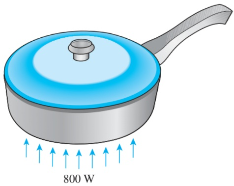

where again the property  $ \alpha = k/\rho c $  is the thermal diffusivity of the material. It reduces to the following forms under specified conditions:

 $$ \begin{array}{c}(1)Steady-state:\\\left(\frac{\partial}{\partial t}=0\right)\end{array}\quad\frac{1}{r^{2}}\frac{d}{dr}\left(r^{2}\frac{dT}{dr}\right)+\frac{\dot{e}_{gen}}{k}=0 $$ 

 $$ \begin{array}{c}(2)Transient,\\\quad no heat generation:\\\quad(\dot{e}_{gen}=0)\end{array}\quad\frac{1}{r^{2}}\frac{\partial}{\partial r}\left(r^{2}\frac{\partial T}{\partial r}\right)=\frac{1}{\alpha}\frac{\partial T}{\partial t} $$ 

 $$ \begin{array}{l}(3)Steady-state,\\ \quad no heat generation:\\ \quad(\partial/\partial t=0and\dot{e}_{gen}=0)\end{array}\quad\frac{d}{dr}\left(r^{2}\frac{dT}{dr}\right)=0\quad or\quad r\frac{d^{2}T}{dr^{2}}+2\frac{dT}{dr}=0 $$ 

where again we replaced the partial derivatives by ordinary derivatives in the one-dimensional steady heat conduction case. For the general solution of Eqs. 2–32 and 2–34 refer to the TOPIC OF SPECIAL INTEREST (A Brief Review of Differential Equations) at the end of this chapter.

## Combined One-Dimensional Heat Conduction Equation

An examination of the one-dimensional transient heat conduction equations for the plane wall, cylinder, and sphere reveals that all three equations can be expressed in a compact form as

 $$ \frac{1}{r^{n}}\frac{\partial}{\partial r}\left(r^{n}k\frac{\partial T}{\partial r}\right)+\dot{e}_{\mathrm{g e n}}=\rho c\frac{\partial T}{\partial t} $$ 

where n = 0 for a plane wall, n = 1 for a cylinder, and n = 2 for a sphere. In the case of a plane wall, it is customary to replace the variable r by x. This equation can be simplified for steady-state or no heat generation cases as described before.

## EXAMPLE 2–2 Heat Conduction through the Bottom of a Pan

Consider a steel pan placed on top of an electric range to cook spaghetti (Fig. 2–17). The bottom section of the pan is 0.4 cm thick and has a diameter of 18 cm. The electric heating unit on the range top consumes 800 W of power during cooking, and 80 percent of the heat generated in the heating element is transferred uniformly to the pan. Assuming constant thermal conductivity, obtain the differential equation that describes the variation of the temperature in the bottom section of the pan during steady operation.

SOLUTION A steel pan placed on top of an electric range is considered. The differential equation for the variation of temperature in the bottom of the pan is to be obtained.

FIGURE 2–17 Schematic for Example 2–2.

Analysis The bottom section of the pan has a large surface area relative to its thickness and can be approximated as a large plane wall. Heat flux is applied to the bottom surface of the pan uniformly, and the conditions on the inner surface are also uniform. Therefore, we expect the heat transfer through the bottom section of the pan to be from the bottom surface toward the top, and heat transfer in this case can reasonably be approximated as being one-dimensional. Taking the direction normal to the bottom surface of the pan to be the x-axis, we will have  $ T = T(x) $  during steady operation since the temperature in this case will depend on x only.