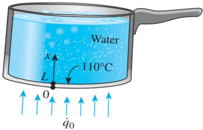

FIGURE 2–31

Schematic for Example 2–6.

## EXAMPLE 2–6 Heat Flux Boundary Condition

Consider an aluminum pan used to cook beef stew on top of an electric range. The bottom section of the pan is L = 0.3 cm thick and has a diameter of D = 20 cm. The electric heating unit on the range top consumes 800 W of power during cooking, and 90 percent of the heat generated in the heating element is transferred to the pan. During steady operation, the temperature of the inner surface of the pan is measured to be 110°C. Express the boundary conditions for the bottom section of the pan during this cooking process.

SOLUTION An aluminum pan on an electric range top is considered. The boundary conditions for the bottom of the pan are to be obtained.

Analysis The heat transfer through the bottom section of the pan is from the bottom surface toward the top and can reasonably be approximated as being one-dimensional. We take the direction normal to the bottom surfaces of the pan as the x axis with the origin at the outer surface, as shown in Fig. 2–31. Then the inner and outer surfaces of the bottom section of the pan can be represented by x = 0 and x = L, respectively. During steady operation, the temperature will depend on x only and thus  $ T = T(x) $ .

The boundary condition on the outer surface of the bottom of the pan at x = 0 can be approximated as being specified heat flux since it is stated that 90 percent of the 800 W (i.e., 720 W) is transferred to the pan at that surface. Therefore,

 $$ -k\frac{dT(0)}{dx}=\dot{q}_{0} $$ 

where

 $$ \dot{q}_{0}=\frac{Heat transfer rate}{Bottom surface area}=\frac{0.720kW}{\pi(0.1m)^{2}}=22.9kW/m^{2} $$ 

The temperature at the inner surface of the bottom of the pan is specified to be  $ 110^{\circ} $ C. Then the boundary condition on this surface can be expressed as

 $$ T(L)=110^{\circ}C $$ 

where L = 0.003 m.

Discussion Note that the determination of the boundary conditions may require some reasoning and approximations.

## 3 Convection Boundary Condition

Convection is probably the most common boundary condition encountered in practice since most heat transfer surfaces are exposed to an environment at a specified temperature. The convection boundary condition is based on a surface energy balance expressed as

 $$ \begin{pmatrix}Heat conduction\\ at the surface in a\\ selected direction\end{pmatrix}=\begin{pmatrix}Heat convection\\ at the surface in\\ the same direction\end{pmatrix} $$ 