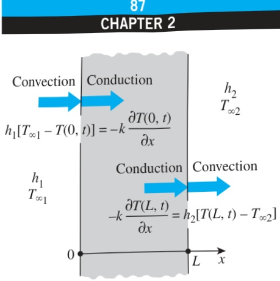
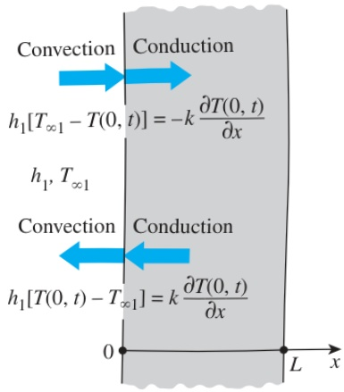

For one-dimensional heat transfer in the x-direction in a plate of thickness L, the convection boundary conditions on both surfaces can be expressed as

 $$ -k\frac{\partial T(0,t)}{\partial x}=h_{1}[T_{\infty1}-T(0,t)] $$ 

and

 $$ -k\frac{\partial T(L,t)}{\partial x}=h_{2}[T(L,t)-T_{\infty2}] $$ 

where  $ h_{1} $  and  $ h_{2} $  are the convection heat transfer coefficients and  $ T_{\infty1} $  and  $ T_{\infty2} $  are the temperatures of the surrounding mediums on the two sides of the plate, as shown in Fig. 2–32.

In writing Eqs. 2–51 for convection boundary conditions, we have selected the direction of heat transfer to be the positive x-direction at both surfaces. But those expressions are equally applicable when heat transfer is in the opposite direction at one or both surfaces since reversing the direction of heat transfer at a surface simply reverses the signs of both conduction and convection terms at that surface. This is equivalent to multiplying an equation by -1, which has no effect on the equality (Fig. 2–33). Being able to select either direction as the direction of heat transfer is certainly a relief since often we do not know the surface temperature and thus the direction of heat transfer at a surface in advance. This argument is also valid for other boundary conditions such as the radiation and combined boundary conditions discussed shortly.

Note that a surface has zero thickness and thus no mass, and it cannot store any energy. Therefore, the entire net heat entering the surface from one side must leave the surface from the other side. The convection boundary condition simply states that heat continues to flow from a body to the surrounding medium at the same rate, and it just changes vehicles at the surface from conduction to convection (or vice versa in the other direction). This is analogous to people traveling on buses on land and transferring to the ships at the shore. If the passengers are not allowed to wander around at the shore, then the rate at which the people are unloaded at the shore from the buses must equal the rate at which they board the ships. We may call this the conservation of “people” principle.

Also note that the surface temperatures  $ T(0, t) $  and  $ T(L, t) $  are not known (if they were known, we would simply use them as the specified temperature boundary condition and not bother with convection). But a surface temperature can be determined once the solution  $ T(x, t) $  is obtained by substituting the value of x at that surface into the solution.

## EXAMPLE 2–7 Convection and Insulation Boundary Conditions

Steam flows through a pipe shown in Fig. 2–34 at an average temperature of  $ T_{\infty} = 200^{\circ}C $ . The inner and outer radii of the pipe are  $ r_{1} = 8  cm $  and  $ r_{2} = 8.5  cm $ , respectively, and the outer surface of the pipe is heavily insulated. If the convection heat transfer coefficient on the inner surface of the pipe is  $ h = 65  W/m^{2} \cdot K $ , express the boundary conditions on the inner and outer surfaces of the pipe during transient periods.

FIGURE 2–32

Convection boundary conditions on the two surfaces of a plane wall.

FIGURE 2–33

The assumed direction of heat transfer at a boundary has no effect on the boundary condition expression.

