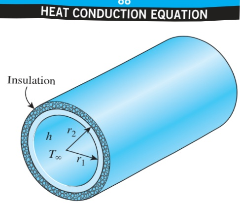
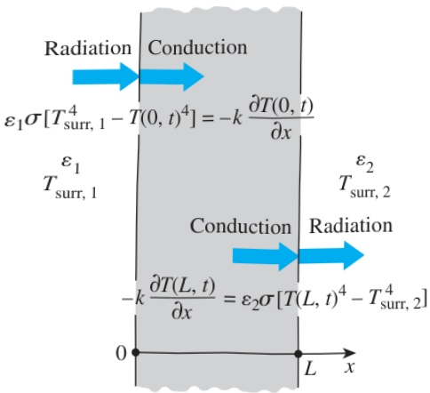

FIGURE 2–34

Schematic for Example 2–7.

FIGURE 2–35

Radiation boundary conditions on both surfaces of a plane wall.

SOLUTION The flow of steam through an insulated pipe is considered. The boundary conditions on the inner and outer surfaces of the pipe are to be obtained.

Analysis During initial transient periods, heat transfer through the pipe material predominantly is in the radial direction, and thus can be approximated as being one-dimensional. Then the temperature within the pipe material changes with the radial distance r and the time t. That is,  $ T = T(r, t) $ .

It is stated that heat transfer between the steam and the pipe at the inner surface is by convection. Then taking the direction of heat transfer to be the positive r direction, the boundary condition on that surface can be expressed as

 $$ -k\frac{\partial T(r_{1},t)}{\partial r}=h[T_{\infty}-T(r_{1})] $$ 

The pipe is said to be well insulated on the outside, and thus heat loss through the outer surface of the pipe can be assumed to be negligible. Then the boundary condition at the outer surface can be expressed as

 $$ \frac{\partial T(r_{2},t)}{\partial r}=0 $$ 

Discussion Note that the temperature gradient must be zero on the outer surface of the pipe at all times.

## 4 Radiation Boundary Condition

In some cases, such as those encountered in space and cryogenic applications, a heat transfer surface is surrounded by an evacuated space and thus there is no convection heat transfer between a surface and the surrounding medium. In such cases, radiation becomes the only mechanism of heat transfer between the surface under consideration and the surroundings. Using an energy balance, the radiation boundary condition on a surface can be expressed as

 $$ \begin{pmatrix}Heat conduction\\ at the surface in a\\ selected direction\end{pmatrix}=\begin{pmatrix}Radiation exchange\\ at the surface in\\ the same direction\end{pmatrix} $$ 

For one-dimensional heat transfer in the x-direction in a plate of thickness L, the radiation boundary conditions on both surfaces can be expressed as (Fig. 2–35)

 $$ -k\frac{\partial T(0,t)}{\partial x}=\varepsilon_{1}\sigma[T_{\mathrm{s u r r},1}^{4}-T(0,t)^{4}] $$ 

and

 $$ -k\frac{\partial T(L,t)}{\partial x}=\varepsilon_{2}\sigma[T(L,t)^{4}-T_{\mathrm{s u r r},2}^{4}] $$ 

where  $ \varepsilon_{1} $  and  $ \varepsilon_{2} $  are the emissivities of the boundary surfaces,  $ \sigma = 5.67 \times 10^{-8} \, W/m^{2} \cdot K^{4} $  is the Stefan–Boltzmann constant, and  $ T_{surr, 1} $  and  $ T_{surr, 2} $  are the average temperatures of the surfaces surrounding the two sides of the plate, respectively. Note that the temperatures in radiation calculations must be expressed in K or R (not in °C or °F).

The radiation boundary condition involves the fourth power of temperature, and thus it is a nonlinear condition. As a result, the application of this boundary condition results in powers of the unknown coefficients, which makes it difficult