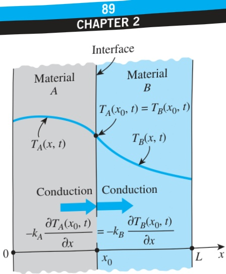
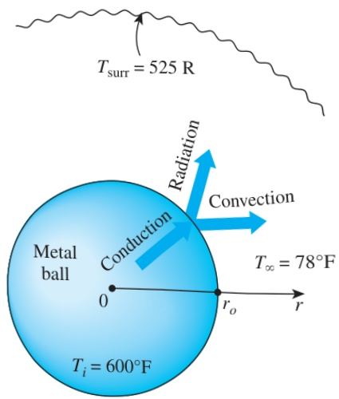

to determine them. Therefore, it is tempting to ignore radiation exchange at a surface during a heat transfer analysis in order to avoid the complications associated with nonlinearity. This is especially the case when heat transfer at the surface is dominated by convection, and the role of radiation is minor.

## 5 Interface Boundary Conditions

Some bodies are made up of layers of different materials, and the solution of a heat transfer problem in such a medium requires the solution of the heat transfer problem in each layer. This, in turn, requires the specification of the boundary conditions at each interface.

The boundary conditions at an interface are based on the requirements that (1) two bodies in contact must have the same temperature at the area of contact and (2) an interface (which is a surface) cannot store any energy, and thus the heat flux on the two sides of an interface must be the same. The boundary conditions at the interface of two bodies A and B in perfect contact at  $ x = x_{0} $  can be expressed as (Fig. 2–36)

 $$ T_{A}(x_{0},t)=T_{B}(x_{0},t) $$ 

and

 $$ -k_{A}\frac{\partial T_{A}(x_{0},t)}{\partial x}=-k_{B}\frac{\partial T_{B}(x_{0},t)}{\partial x} $$ 

where  $ k_{A} $  and  $ k_{B} $  are the thermal conductivities of the layers A and B, respectively. The case of imperfect contact results in thermal contact resistance, which is considered in the next chapter.

## 6 Generalized Boundary Conditions

So far we have considered surfaces subjected to single mode heat transfer, such as the specified heat flux, convection, or radiation for simplicity. In general, however, a surface may involve convection, radiation, and specified heat flux simultaneously. The boundary condition in such cases is again obtained from a surface energy balance, expressed as

 $$ \begin{pmatrix}Heat transfer\\to the surface\\in all modes\end{pmatrix}=\begin{pmatrix}Heat transfer\\from the surface\\in all modes\end{pmatrix} $$ 

This is illustrated in Examples 2–8 and 2–9.

## EXAMPLE 2–8 Combined Convection and Radiation Condition

A spherical metal ball of radius  $ r_{o} $  is heated in an oven to a temperature of  $ 600^{\circ}F $  throughout and is then taken out of the oven and allowed to cool in ambient air at  $ T_{\infty} = 78^{\circ}F $ , as shown in Fig. 2–37. The thermal conductivity of the ball material is  $ k = 8.3\ Btu/h\cdotft\cdotR $ , and the average convection heat transfer coefficient on the outer surface of the ball is evaluated to be  $ h = 4.5\ Btu/h\cdotft^{2}\cdotR $ . The emissivity of the outer surface of the ball is  $ \varepsilon = 0.6 $ , and the average temperature of the surrounding surfaces is  $ T_{surr} = 525\ R $ . Assuming the ball is cooled uniformly from the entire outer surface, express the initial and boundary conditions for the cooling process of the ball.

FIGURE 2–36

Boundary conditions at the interface of two bodies in perfect contact.

Schematic for Example 2–8.

