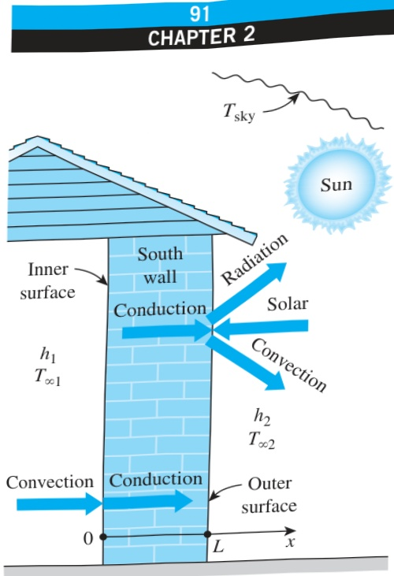

Analysis We take the direction normal to the wall surfaces as the x-axis with the origin at the inner surface of the wall, as shown in Fig. 2–38. The heat transfer through the wall is given to be steady and one-dimensional, and thus the temperature depends on x only and not on time. That is,  $  T = T(x)  $ .

The boundary condition on the inner surface of the wall at x = 0 is a typical convection condition since it does not involve any radiation or specified heat flux. Taking the direction of heat transfer to be the positive x-direction, the boundary condition on the inner surface can be expressed as

 $$ -k\frac{d T(0)}{d x}=h_{1}[T_{\infty1}-T(0)] $$ 

The boundary condition on the outer surface at x = 0 is quite general as it involves conduction, convection, radiation, and specified heat flux. Again taking the direction of heat transfer to be the positive x-direction, the boundary condition on the outer surface can be expressed as

 $$ -k\frac{d T(L)}{d x}=h_{2}[T(L)-T_{\infty2}]+\varepsilon_{2}\sigma[T(L)^{4}-T_{\mathrm{s k y}}^{4}]-\alpha\dot{q}_{\mathrm{s o l a r}} $$ 

where  $ \dot{q}_{solar} $  is the incident solar heat flux.

Discussion Assuming the opposite direction for heat transfer would give the same result multiplied by -1, which is equivalent to the relation here. All the quantities in these relations are known except the temperatures and their derivatives at the two boundaries.

Note that a heat transfer problem may involve different kinds of boundary conditions on different surfaces. For example, a plate may be subject to heat flux on one surface while losing or gaining heat by convection from the other surface. Also, the two boundary conditions in a direction may be specified at the same boundary, while no condition is imposed on the other boundary. For example, specifying the temperature and heat flux at x = 0 of a plate of thickness L will result in a unique solution for the one-dimensional steady temperature distribution in the plate, including the value of temperature at the surface x = L. Although not necessary, there is nothing wrong with specifying more than two boundary conditions in a specified direction, provided that there is no contradiction. The extra conditions in this case can be used to verify the results.

## 2 –5 SOLUTION OF STEADY ONE-DIMENSIONAL HEAT CONDUCTION PROBLEMS

So far we have derived the differential equations for heat conduction in various coordinate systems and discussed the possible boundary conditions. A heat conduction problem can be formulated by specifying the applicable differential equation and a set of proper boundary conditions.

In this section we will solve a wide range of heat conduction problems in rectangular, cylindrical, and spherical geometries. We will limit our attention to problems that result in ordinary differential equations such as the steady one-dimensional heat conduction problems. We will also assume constant thermal conductivity, but will consider variable conductivity later in this

Schematic for Example 2–9.

