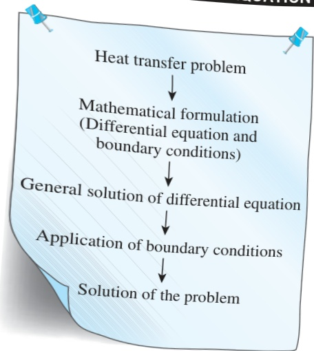
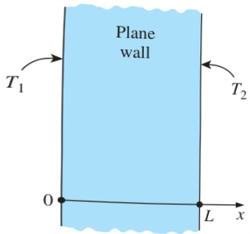

## 92 HEAT CONDUCTION EQUATION

## FIGURE 2–39

Basic steps involved in the solution of heat transfer problems.

FIGURE 2–40

Schematic for Example 2–10.

Chapter. If you feel rusty on differential equations or haven't taken differential equations yet, no need to panic. Simple integration is all you need to solve the steady one-dimensional heat conduction problems.

The solution procedure for solving heat conduction problems can be summarized as (1) formulate the problem by obtaining the applicable differential equation in its simplest form and specifying the boundary conditions, (2) obtain the general solution of the differential equation, and (3) apply the boundary conditions and determine the arbitrary constants in the general solution (Fig. 2–39). This is demonstrated below with examples.

## EXAMPLE 2–10 Heat Conduction in a Plane Wall

Consider a large plane wall of thickness L = 0.2 m, thermal conductivity  $ k = 1.2 \, W/m \cdot K $ , and surface area  $ A = 15 \, m^{2} $ . The two sides of the wall are maintained at constant temperatures of  $ T_{1} = 120^{\circ}C $  and  $ T_{2} = 50^{\circ}C $ , respectively, as shown in Fig. 2–40. Determine (a) the variation of temperature within the wall and the value of temperature at x = 0.1 m and (b) the rate of heat conduction through the wall under steady conditions.

SOLUTION A plane wall with specified surface temperatures is given. The variation of temperature and the rate of heat transfer are to be determined.

Assumptions 1 Heat conduction is steady. 2 Heat conduction is one-dimensional since the wall is large relative to its thickness and the thermal conditions on both sides are uniform. 3 Thermal conductivity is constant. 4 There is no heat generation.

Properties The thermal conductivity is given to be  $ k = 1.2 \, W/m \cdot K $ .

Analysis (a) Taking the direction normal to the surface of the wall to be the x-direction, the differential equation for this problem can be expressed as

 $$ \frac{d^{2}T}{dx^{2}}=0 $$ 

with boundary conditions

 $$ \begin{aligned}T(0)&=T_{1}=120^{\circ}C\\T(L)&=T_{2}=50^{\circ}C\end{aligned} $$ 

The differential equation is linear and second order, and a quick inspection of it reveals that it has a single term involving derivatives and no terms involving the unknown function T as a factor. Thus, it can be solved by direct integration. Noting that an integration reduces the order of a derivative by one, the general solution of the differential equation above can be obtained by two simple successive integrations, each of which introduces an integration constant.

Integrating the differential equation once with respect to x yields

 $$ \frac{dT}{dx}=C_{1} $$ 

where  $ C_{1} $  is an arbitrary constant. Notice that the order of the derivative went down by one as a result of integration. As a check, if we take the derivative of this equation, we will obtain the original differential equation. This equation is not the solution yet since it involves a derivative.