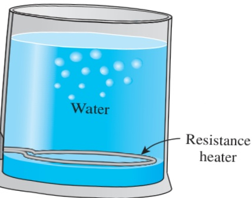

FIGURE 2–18  chematic for Example 2–3.

The thermal conductivity is given to be constant, and there is no heat generation in the medium (within the bottom section of the pan). Therefore, the differential equation governing the variation of temperature in the bottom section of the pan in this case is simply Eq. 2–17,

 $$ \frac{d^{2}T}{dx^{2}}=0 $$ 

which is the steady one-dimensional heat conduction equation in rectangular coordinates under the conditions of constant thermal conductivity and no heat generation.

Discussion Note that the conditions at the surface of the medium have no effect on the differential equation.

## EXAMPLE 2–3 Heat Conduction in a Resistance Heater

A 2-kW resistance heater wire with thermal conductivity  $ k = 15 \, W/m \cdot K $ , diameter D = 0.4 cm, and length L = 50 cm is used to boil water by immersing it in water (Fig. 2–18). Assuming the variation of the thermal conductivity of the wire with temperature to be negligible, obtain the differential equation that describes the variation of the temperature in the wire during steady operation.

SOLUTION The resistance wire of a water heater is considered. The differential equation for the variation of temperature in the wire is to be obtained.

Analysis The resistance wire can be considered to be a very long cylinder since its length is more than 100 times its diameter. Also, heat is generated uniformly in the wire and the conditions on the outer surface of the wire are uniform. Therefore, it is reasonable to expect the temperature in the wire to vary in the radial r direction only and thus the heat transfer to be one-dimensional. Then we have  $ T = T(r) $  during steady operation since the temperature in this case depends on r only.

The rate of heat generation in the wire per unit volume can be determined from

 $$ \dot{e}_{gen}=\frac{\dot{E}_{gen}}{V_{wire}}=\frac{\dot{E}_{gen}}{(\pi D^{2}/4)L}=\frac{2000W}{[\pi(0.004m)^{2}/4](0.5m)}=0.318\times10^{9}W/m^{3} $$ 

Noting that the thermal conductivity is given to be constant, the differential equation that governs the variation of temperature in the wire is simply Eq. 2–27,

 $$ \frac{1}{r}\frac{d}{d r}\bigg(r\frac{d T}{d r}\bigg)+\frac{\dot{e}_{\mathrm{g e n}}}{k}=0 $$ 

which is the steady one-dimensional heat conduction equation in cylindrical coordinates for the case of constant thermal conductivity.

Discussion Note again that the conditions at the surface of the wire have no effect on the differential equation.