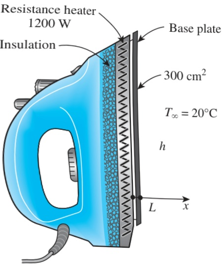

## HEAT CONDUCTION EQUATION

Differential equation:
 $$  T'(x) = 0  $$ 
General solution:
 $$  T(x) = C_1 x + C_2  $$ 
(a) Unique solution:
 $$  -kT'(0) = \dot{q}_0  $$ 
 $$  T'(0) = T_0  $$ 
(b) No solution:
 $$  -kT'(0) = \dot{q}_0  $$ 
 $$  -kT'(L) = \dot{q}_L  $$ 
(c) Multiple solutions:
 $$  -kT'(0) = \dot{q}_0  $$ 
 $$  -kT'(L) = \dot{q}_0  $$ 
 $$  T(x) = -\frac{\dot{q}_0}{k} x + C_2  $$ 
 $$  \uparrow  $$ 
Arbitrary

## FIGURE 2–44

A boundary-value problem may have a unique solution, infinitely many solutions, or no solutions at all.

FIGURE 2–45

Schematic for Example 2–12.

Discussion The last solution represents a family of straight lines whose slope is  $ -\dot{q}_{0}/k $ . Physically, this problem corresponds to requiring the rate of heat supplied to the wall at x = 0 be equal to the rate of heat removal from the other side of the wall at x = L. But this is a consequence of the heat conduction through the wall being steady, and thus the second boundary condition does not provide any new information. So it is not surprising that the solution of this problem is not unique. The three cases discussed above are summarized in Fig. 2–44.

## EXAMPLE 2–12 Heat Conduction in the Base Plate of an Iron

Consider the base plate of a 1200-W household iron that has a thickness of  $ L = 0.5 \, cm $ , base area of  $ A = 300 \, cm^2 $ , and thermal conductivity of  $ k = 15 \, W/m \cdot K $ . The inner surface of the base plate is subjected to uniform heat flux generated by the resistance heaters inside, and the outer surface loses heat to the surroundings at  $ T_{\infty} = 20^{\circ}C $  by convection, as shown in Fig. 2–45. Taking the convection heat transfer coefficient to be  $ h = 80 \, W/m^2 \cdot K $  and disregarding heat loss by radiation, obtain an expression for the variation of temperature in the base plate, and evaluate the temperatures at the inner and the outer surfaces.

SOLUTION The base plate of an iron is considered. The variation of temperature in the plate and the surface temperatures are to be determined.

Assumptions 1 Heat transfer is steady since there is no change with time. 2 Heat transfer is one-dimensional since the surface area of the base plate is large relative to its thickness, and the thermal conditions on both sides are uniform. 3 Thermal conductivity is constant. 4 There is no heat generation in the medium. 5 Heat transfer by radiation is negligible. 6 The upper part of the iron is well insulated so that the entire heat generated in the resistance wires is transferred to the base plate through its inner surface.

Properties The thermal conductivity is given to be  $ k = 15 \, W/m \cdot K $ .

Analysis The inner surface of the base plate is subjected to uniform heat flux at a rate of

 $$ \dot{q}_{0}=\frac{\dot{Q}_{0}}{A_{base}}=\frac{1200\ W}{0.03\ m^{2}}=40,000\ W/m^{2} $$ 

The outer side of the plate is subjected to the convection condition. Taking the direction normal to the surface of the wall as the x-direction with its origin on the inner surface, the differential equation for this problem can be expressed as (Fig. 2–46)

 $$ \frac{d^{2}T}{dx^{2}}=0 $$ 

with the boundary conditions

 $$ -k\frac{dT(0)}{dx}=\dot{q}_{0}=40,000\ W/m^{2} $$ 

 $$ -k\frac{dT(L)}{dx}=h[T(L)-T_{\infty}] $$ 