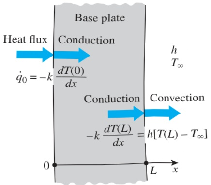

The general solution of the differential equation is again obtained by two successive integrations to be

and

 $$ \frac{dT}{dx}=C_{1} $$ 

 $$ T(x)=C_{1}x+C_{2} $$ 

where  $ C_{1} $  and  $ C_{2} $  are arbitrary constants. Applying the first boundary condition,

 $$ -k\frac{dT(0)}{dx}=\dot{q}_{0}\quad\rightarrow\quad-kC_{1}=\dot{q}_{0}\quad\rightarrow\quad C_{1}=-\frac{\dot{q}_{0}}{k} $$ 

Noting that  $ dT/dx = C_{1} $  and  $ T(L) = C_{1}L + C_{2} $ , the application of the second boundary condition gives

 $$ -k\frac{dT(L)}{dx}=h[T(L)-T_{\infty}]\quad\rightarrow\quad-kC_{1}=h[(C_{1}L+C_{2})-T_{\infty}] $$ 

Substituting  $ C_{1} = -\dot{q}_{0}/k $  and solving for  $ C_{2} $ , we obtain

 $$ C_{2}=T_{\infty}+\frac{\dot{q}_{0}}{h}+\frac{\dot{q}_{0}}{k}L $$ 

Now substituting  $ C_{1} $  and  $ C_{2} $  into the general solution (a) gives

 $$ T(x)=T_{\infty}+\dot{q}_{0}\bigg(\frac{L-x}{k}+\frac{1}{h}\bigg) $$ 

which is the solution for the variation of the temperature in the plate. The temperatures at the inner and outer surfaces of the plate are determined by substituting x = 0 and x = L, respectively, into the relation (b):

 $$ \begin{aligned}T(0)&=T_{\infty}+\dot{q}_{0}\Bigg(\frac{L}{k}+\frac{1}{h}\Bigg)\\&=20^{\circ}\mathbf{C}+(40,000\mathbf{W}/\mathbf{m}^{2})\Bigg(\frac{0.005\mathbf{m}}{15\mathbf{W}/\mathbf{m}\cdot\mathbf{K}}+\frac{1}{80\mathbf{W}/\mathbf{m}^{2}\cdot\mathbf{K}}\Bigg)=533^{\circ}\mathbf{C}\end{aligned} $$ 

and

 $$ T(L)=T_{\infty}+\dot{q}_{0}\bigg(0+\frac{1}{h}\bigg)=20^{\circ}\mathbf{C}+\frac{40,000\mathbf{W}/\mathbf{m}^{2}}{80\mathbf{W}/\mathbf{m}^{2}\cdot\mathbf{K}}=520^{\circ}\mathbf{C} $$ 

Discussion Note that the temperature of the inner surface of the base plate is  $ 13^{\circ} $ C higher than the temperature of the outer surface when steady operating conditions are reached. Also note that this heat transfer analysis enables us to calculate the temperatures of surfaces that we cannot even reach. This example demonstrates how the heat flux and convection boundary conditions are applied to heat transfer problems.

## CHAPTER 2

FIGURE 2–46

The boundary conditions on the base plate of the iron discussed in Example 2–12.