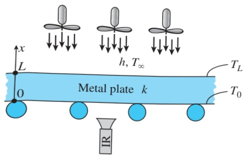

FIGURE 2–47

Schematic for Example 2–13.

## EXAMPLE 2–13 Thermal Burn Prevention in Metal Processing Plant

In metal processing plants, workers often operate near hot metal surfaces. Exposed hot surfaces are hazards that can potentially cause thermal burns on human skin tissue. Metallic surface with a temperature above  $ 70^{\circ} $ C is considered extremely hot. Damage to skin tissue can occur instantaneously upon contact with metallic surface at that temperature. In a plant that processes metal plates, a plate is conveyed through a series of fans to cool its surface in an ambient temperature of  $ 30^{\circ} $ C, as shown in Figure 2-47. The plate is 25 mm thick and has a thermal conductivity of  $ 13.5 \, W/m \cdot K $ . Temperature at the bottom surface of the plate is monitored by an infrared (IR) thermometer. Obtain an expression for the variation of temperature in the metal plate. The IR thermometer measures the bottom surface of the plate to be  $ 60^{\circ} $ C. Determine the minimum value of the convection heat transfer coefficient necessary to keep the top surface below  $ 47^{\circ} $ C to avoid instantaneous thermal burn upon accidental contact of hot metal surface with skin tissue.

SOLUTION In this example, the concepts of Prevention through Design (PtD) are applied in conjunction with the solution of steady one-dimensional heat conduction problem. The top surface of the plate is cooled by convection, and temperature at the bottom surface is measured by an IR thermometer. The variation of temperature in the metal plate and the convection heat transfer coefficient necessary to keep the top surface below  $ 47^{\circ} $ C are to be determined.

Assumptions 1 Heat conduction is steady and one-dimensional. 2 Thermal conductivity is constant. 3 There is no heat generation in the plate. 4 The bottom surface at x = 0 is at constant temperature while the top surface at x = L is subjected to convection.

Properties The thermal conductivity of the metal plate is given to be k = 13.5 W/m·K.

Analysis Taking the direction normal to the surface of the wall to be the x direction with x = 0 at the lower surface, the mathematical formulation can be expressed as

 $$ \frac{d^{2}T}{dx^{2}}=0 $$ 

with boundary conditions

 $$ \begin{aligned}T(0)&=T_{0}\\-k\frac{dT(L)}{dx}&=h[T(L)-T_{\infty}]\end{aligned} $$ 

Integrating the differential equation twice with respect to x yields

 $$ \begin{aligned}\frac{dT}{dx}&=C_{1}\\T(x)&=C_{1}x+C_{2}\end{aligned} $$ 

where  $ C_{1} $  and  $ C_{2} $  are arbitrary constants. Applying the first boundary condition yields

 $$ T(0)=C_{1}\times0+C_{2}=T_{0}\rightarrow C_{2}=T_{0} $$ 