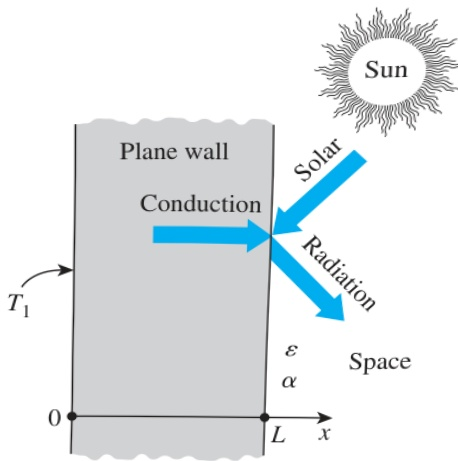

The application of the second boundary condition gives

 $$ -k\frac{dT(L)}{dx}=h[T(L)-T_{\infty}]\quad\rightarrow\quad-kC_{1}=h(C_{1}L+C_{2}-T_{\infty}) $$ 

Solving for  $ C_{1} $  yields

 $$ C_{1}=\frac{h(T_{\infty}-C_{2})}{k+hL}=\frac{T_{\infty}-T_{0}}{(k/h)+L} $$ 

Now substituting  $ C_{1} $  and  $ C_{2} $  into the general solution, the variation of temperature becomes

 $$ T(x)=\frac{T_{\infty}-T_{0}}{(k/h)+L}x+T_{0} $$ 

The minimum convection heat transfer coefficient necessary to maintain the top surface below  $ 47^{\circ} $ C can be determined from the variation of temperature:

 $$ T(L)=T_{L}=\frac{T_{\infty}-T_{0}}{(k/h)+L}L+T_{0} $$ 

Solving for h gives

 $$ h=\frac{k}{L}\frac{T_{L}-T_{0}}{T_{\infty}-T_{L}}=\left(\frac{13.5\ W/m\cdot K}{0.025\ m}\right)\frac{(47-60)^{\circ}C}{(30-47)^{\circ}C}=413\ W/m^{2}\cdot K $$ 

Discussion To keep the top surface of the metal plate below  $ 47^{\circ} $ C, the convection heat transfer coefficient should be greater than  $ 413 \, W/m^{2} \cdot K $ . A convection heat transfer coefficient value of  $ 413 \, W/m^{2} \cdot K $  is very high for forced convection of gases. The typical values for forced convection of gases are  $ 25–250 \, W/m^{2} \cdot K $  (see Table 1-5 in Chapter 1). To protect workers from thermal burn, appropriate apparel should be worn when operating in an area where hot surfaces are present.

## EXAMPLE 2–14 Heat Conduction in a Solar Heated Wall

Consider a large plane wall of thickness $L = 0.06$ m and thermal conductivity $k = 1.2$ W/m·K in space. The wall is covered with white porcelain tiles that have an emissivity of $\varepsilon = 0.85$ and a solar absorptivity of $\alpha = 0.26$, as shown in Fig. 2–48. The inner surface of the wall is maintained at $T_{1} = 300$ K at all times, while the outer surface is exposed to solar radiation that is incident at a rate of $\dot{q}_{\mathrm{solar}} = 800$ W/m². The outer surface is also losing heat by radiation to deep space at 0 K. Determine the temperature of the outer surface of the wall and the rate of heat transfer through the wall when steady operating conditions are reached. What would your response be if no solar radiation was incident on the surface?

SOLUTION A plane wall in space is subjected to specified temperature on one side and solar radiation on the other side. The outer surface temperature and the rate of heat transfer are to be determined.

Assumptions 1 Heat transfer is steady since there is no change with time. 2 Heat transfer is one-dimensional since the wall is large relative to its thickness, and the thermal conditions on both sides are uniform. 3 Thermal conductivity is constant. 4 There is no heat generation.

FIGURE 2–48

Schematic for Example 2–14.

