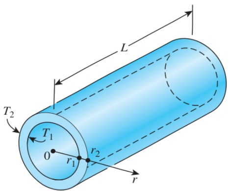

which is an implicit relation for the outer surface temperature  $ T_{L} $ . Substituting the given values, we get

 $$ T_{L}=\frac{0.26\times(800\mathrm{~W}/\mathrm{m}^{2})-0.85\times(5.67\times10^{-8}\mathrm{~W}/\mathrm{m}^{2}\cdot\mathrm{K}^{4})T_{L}^{4}}{1.2\mathrm{~W}/\mathrm{m}\cdot\mathrm{K}}(0.06\mathrm{~m})+300\mathrm{~K} $$ 

which simplifies to

 $$ T_{L}=310.4-0.240975\bigg(\frac{T_{L}}{100}\bigg)^{4} $$ 

This equation can be solved by one of the several nonlinear equation solvers available (or by the old fashioned trial-and-error method) to give (Fig. 2–49)

 $$ T_{L}=292.7\textbf{K} $$ 

Knowing the outer surface temperature and knowing that it must remain constant under steady conditions, the temperature distribution in the wall can be determined by substituting the  $ T_{L} $  value above into Eq. (c):

 $$ T(x)=\frac{0.26\times(800\mathrm{~W}/\mathrm{m}^{2})-0.85\times(5.67\times10^{-8}\mathrm{~W}/\mathrm{m}^{2}\cdot\mathrm{K}^{4})(292.7\mathrm{~K})^{4}}{1.2\mathrm{~W}/\mathrm{m}\cdot\mathrm{K}}x+300\mathrm{~K} $$ 

which simplifies to

 $$ T(x)=(-121.5\mathrm{~K/m})x+300\mathrm{~K} $$ 

Note that the outer surface temperature turned out to be lower than the inner surface temperature. Therefore, the heat transfer through the wall is toward the outside despite the absorption of solar radiation by the outer surface. Knowing both the inner and outer surface temperatures of the wall, the steady rate of heat conduction through the wall can be determined from

 $$ \dot{q}=k\frac{T_{1}-T_{L}}{L}=(1.2\ W/m\cdot K)\frac{(300-292.7)\ K}{0.06\ m}=146\ W/m^{2} $$ 

Discussion In the case of no incident solar radiation, the outer surface temperature, determined from Eq. (d) by setting  $ \dot{q}_{solar} = 0 $ , is  $ T_{L} = 284.3 K $ . It is interesting to note that the solar energy incident on the surface causes the surface temperature to increase by about 8 K only when the inner surface temperature of the wall is maintained at 300 K.

## EXAMPLE 2–15 Heat Loss through a Steam Pipe

Consider a steam pipe of length L = 20 m, inner radius  $ r_{1} = 6 $  cm, outer radius  $ r_{2} = 8 $  cm, and thermal conductivity k = 20 W/m·K, as shown in Fig. 2–50. The inner and outer surfaces of the pipe are maintained at average temperatures of  $ T_{1} = 150^{\circ}C $  and  $ T_{2} = 60^{\circ}C $ , respectively. Obtain a general relation for the temperature distribution inside the pipe under steady conditions, and determine the rate of heat loss from the steam through the pipe.

SOLUTION A steam pipe is subjected to specified temperatures on its surfaces. The variation of temperature and the rate of heat transfer are to be determined.

## CHAPTER 2

(1) Rearrange the equation to be solved:

 $$ T_{L}=310.4-0.240975\left(\frac{T_{L}}{100}\right)^{4} $$ 

The equation is in the proper form since the left side consists of  $ T_{L} $  only.

(2) Guess the value of  $ T_{L} $ , say 300 K, and substitute into the right side of the equation. It gives

 $$ T_{L}=290.2K $$ 

(3) Now substitute this value of  $ T_{L} $  into the right side of the equation and get

 $$ T_{L}=293.1K $$ 

(4) Repeat step (3) until convergence to desired accuracy is achieved. The subsequent iterations give

 $$ \begin{array}{l}T_{L}=292.6K\\T_{L}=292.7K\\T_{L}=292.7K\end{array} $$ 

Therefore, the solution is  $ T_{L}=292.7 $  K. The result is independent of the initial guess.

## FIGURE 2–49

A simple method of solving a nonlinear equation is to arrange the equation such that the unknown is alone on the left side while everything else is on the right side, and to iterate after an initial guess until convergence.

FIGURE 2–50 Schematic for Example 2–14.

