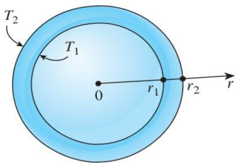

Discussion Note that the total rate of heat transfer through a pipe is constant, but the heat flux  $ \dot{q} = \dot{Q}/(2\pi rL) $  is not since it decreases in the direction of heat transfer with increasing radius.

## EXAMPLE 2–16 Heat Conduction through a Spherical Shell

Consider a spherical container of inner radius  $ r_{1} = 8 $  cm, outer radius  $ r_{2} = 10 $  cm, and thermal conductivity k = 45 W/m·K, as shown in Fig. 2–52. The inner and outer surfaces of the container are maintained at constant temperatures of  $ T_{1} = 200^{\circ} $ C and  $ T_{2} = 80^{\circ} $ C, respectively, as a result of some chemical reactions occurring inside. Obtain a general relation for the temperature distribution inside the shell under steady conditions, and determine the rate of heat loss from the container.

SOLUTION A spherical container is subjected to specified temperatures on its surfaces. The variation of temperature and the rate of heat transfer are to be determined.

Assumptions 1 Heat transfer is steady since there is no change with time. 2 Heat transfer is one-dimensional since there is thermal symmetry about the midpoint, and thus  $ T = T(r) $ . 3 Thermal conductivity is constant. 4 There is no heat generation.

Properties The thermal conductivity is given to be k = 45 W/m·K.

Analysis The mathematical formulation of this problem can be expressed as

 $$ \frac{d}{dr}\left(r^{2}\frac{dT}{dr}\right)=0 $$ 

with boundary conditions

 $$ \begin{aligned}T(r_{1})&=T_{1}=200^{\circ}C\\T(r_{2})&=T_{2}=80^{\circ}C\end{aligned} $$ 

Integrating the differential equation once with respect to r yields

 $$ r^{2}\frac{dT}{dr}=C_{1} $$ 

where  $ C_{1} $  is an arbitrary constant. We now divide both sides of this equation by  $ r^{2} $  to bring it to a readily integrable form,

 $$ \frac{dT}{dr}=\frac{C_{1}}{r^{2}} $$ 

Again integrating with respect to r gives

 $$ T(r)=-\frac{C_{1}}{r}+C_{2} $$ 

We now apply both boundary conditions by replacing all occurrences of r and  $ T(r) $  in the relation above by the specified values at the boundaries. We get

 $$ T(r_{1})=T_{1}\quad\rightarrow\quad-\frac{C_{1}}{r_{1}}+C_{2}=T_{1} $$ 

 $$ T(r_{2})=T_{2}\quad\rightarrow\quad-\frac{C_{1}}{r_{2}}+C_{2}=T_{2} $$ 

FIGURE 2–52

Schematic for Example 2–16.

