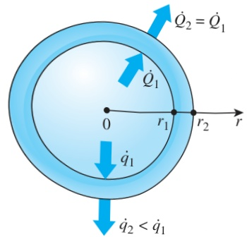
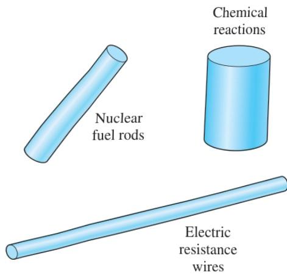

 $$ \dot{q}_{1}=\frac{\dot{Q}_{1}}{A_{1}}=\frac{27.1\ kW}{4\pi(0.08\ m)^{2}}=337\ kW/m^{2} $$ 

 $$ \dot{q}_{2}=\frac{\dot{Q}_{2}}{A_{2}}=\frac{27.1\ kW}{4\pi(0.10\ m)^{2}}=216\ kW/m^{2} $$ 

## FIGURE 2–53

During steady one-dimensional heat conduction in a spherical (or cylindrical) container, the total rate of heat transfer remains constant, but the heat flux decreases with increasing radius.

which are two equations in two unknowns,  $ C_{1} $  and  $ C_{2} $ . Solving them simultaneously gives

 $$ C_{1}=-\frac{r_{1}r_{2}}{r_{2}-r_{1}}(T_{1}-T_{2})\quad and\quad C_{2}=\frac{r_{2}T_{2}-r_{1}T_{1}}{r_{2}-r_{1}} $$ 

Heat generation in solids is commonly encountered in practice.

Substituting into Eq. (a), the variation of temperature within the spherical shell is determined to be

 $$ T(r)=\frac{r_{1}r_{2}}{r(r_{2}-r_{1})}\left(T_{1}-T_{2}\right)+\frac{r_{2}T_{2}-r_{1}T_{1}}{r_{2}-r_{1}} $$ 

The rate of heat loss from the container is simply the total rate of heat conduction through the container wall and is determined from Fourier's law

 $$ \dot{Q}_{sphere}=-kA\frac{dT}{dr}=-k(4\pi r^{2})\frac{C_{1}}{r^{2}}=-4\pi kC_{1}=4\pi kr_{1}r_{2}\frac{T_{1}-T_{2}}{r_{2}-r_{1}} $$ 

The numerical value of the rate of heat conduction through the wall is determined by substituting the given values to be

 $$ \dot{Q}=4\pi(45\mathrm{~W/m}\cdot\mathrm{K})(0.08\mathrm{~m})(0.10\mathrm{~m})\frac{(200-80)^{\circ}\mathrm{C}}{(0.10-0.08)\mathrm{~m}}=27.1\mathrm{~kW} $$ 

Discussion Note that the total rate of heat transfer through a spherical shell is constant, but the heat flux  $ \dot{q} = \dot{Q}/4\pi r^{2} $  is not since it decreases in the direction of heat transfer with increasing radius as shown in Fig. 2–53.

## 2 –6 HEAT GENERATION IN A SOLID

Many practical heat transfer applications involve the conversion of some form of energy into thermal energy in the medium. Such mediums are said to involve internal heat generation, which manifests itself as a rise in temperature throughout the medium. Some examples of heat generation are resistance heating in wires, exothermic chemical reactions in a solid, and nuclear reactions in nuclear fuel rods where electrical, chemical, and nuclear energies are converted to heat, respectively (Fig. 2–54). The absorption of radiation throughout the volume of a semitransparent medium such as water can also be considered as heat generation within the medium, as explained earlier.

Heat generation is usually expressed per unit volume of the medium, and is denoted by  $ \dot{e}_{gen} $ , whose unit is W/m $ ^{3} $ . For example, heat generation in an electrical wire of outer radius  $ r_{o} $  and length L can be expressed as

 $$ \dot{e}_{gen}=\frac{\dot{E}_{gen,electric}}{V_{wire}}=\frac{I^{2}R_{e}}{\pi r_{o}^{2}L}\qquad(W/m^{3}) $$ 

where I is the electric current and  $ R_{e} $  is the electrical resistance of the wire.

The temperature of a medium rises during heat generation as a result of the absorption of the generated heat by the medium during transient start-up period. As the temperature of the medium increases, so does the heat transfer from the medium to its surroundings. This continues until steady operating