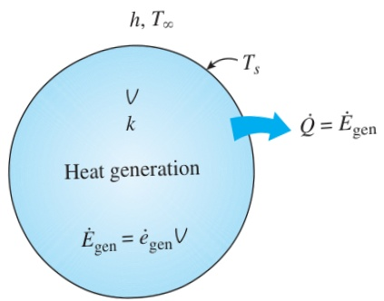

conditions are reached and the rate of heat generation equals the rate of heat transfer to the surroundings. Once steady operation has been established, the temperature of the medium at any point no longer changes.

The maximum temperature  $ T_{max} $  in a solid that involves uniform heat generation occurs at a location farthest away from the outer surface when the outer surface of the solid is maintained at a constant temperature  $ T_{s} $ . For example, the maximum temperature occurs at the midplane in a plane wall, at the centerline in a long cylinder, and at the midpoint in a sphere. The temperature distribution within the solid in these cases is symmetrical about the center of symmetry.

The quantities of major interest in a medium with heat generation are the surface temperature  $ T_{s} $  and the maximum temperature  $ T_{max} $  that occurs in the medium in steady operation. Below we develop expressions for these two quantities for common geometries for the case of uniform heat generation ( $ \dot{e}_{gen} = constant $ ) within the medium.

Consider a solid medium of surface area  $ A_{s} $ , volume V, and constant thermal conductivity k, where heat is generated at a constant rate of  $ \dot{e}_{gen} $  per unit volume. Heat is transferred from the solid to the surrounding medium at  $ T_{\infty} $ , with a constant heat transfer coefficient of h. All the surfaces of the solid are maintained at a common temperature  $ T_{s} $ . Under steady conditions, the energy balance for this solid can be expressed as (Fig. 2–55)

 $$ \begin{pmatrix}\text{Rate of}\\ heat transfer\\ from the solid\end{pmatrix}=\begin{pmatrix}\text{Rate of}\\ energy generation\\ within the solid\end{pmatrix} $$ 

or

 $$ \dot{Q}=\dot{e}_{\mathrm{g e n}}V\qquad(\mathrm{W}) $$ 

Disregarding radiation (or incorporating it in the heat transfer coefficient h), the heat transfer rate can also be expressed from Newton’s law of cooling as

 $$ \dot{Q}=h A_{s}\left(T_{s}-T_{\infty}\right)\qquad(\mathrm{W}) $$ 

Combining Eqs. 2–64 and 2–65 and solving for the surface temperature  $ T_{s} $  gives

 $$ T_{s}=T_{\infty}+\frac{\dot{e}_{gen}V}{hA_{s}} $$ 

For a large plane wall of thickness 2L ( $ A_{s}=2A_{wall} $  and  $ \forall=2LA_{wall} $ ) with both sides of the wall maintained at the same temperature  $ T_{s} $ , a long solid cylinder of radius  $ r_{o} $  ( $ A_{s}=2\pi r_{o}L $  and  $ \forall=\pi r_{o}^{2}L $ ), and a solid sphere of radius  $ r_{o} $  ( $ A_{s}=4\pi r_{o}^{2} $  and  $ \forall=\frac{4}{3}\pi r_{o}^{3} $ ), Eq. 2–66 reduces to

 $$ T_{s,\mathrm{plane wall}}=T_{\infty}+\frac{\dot{e}_{\mathrm{gen}}L}{h} $$ 

 $$ T_{s,\text{cylinder}}=T_{\infty}+\frac{\dot{e}_{\text{gen}}r_{o}}{2h} $$ 

 $$ T_{s,\mathrm{sphere}}=T_{\infty}+\frac{\dot{e}_{\mathrm{gen}}r_{o}}{3h} $$ 

FIGURE 2–55

At steady conditions, the entire heat generated in a solid must leave the solid through its outer surface.