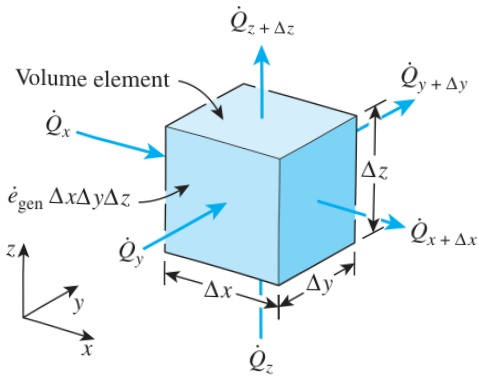

## EXAMPLE 2–4 Cooling of a Hot Metal Ball in Air

A spherical metal ball of radius R is heated in an oven to a temperature of  $ 600^{\circ} $ F throughout and is then taken out of the oven and allowed to cool in ambient air at  $ T_{\infty} = 75^{\circ} $ F by convection and radiation (Fig. 2–19). The thermal conductivity of the ball material is known to vary linearly with temperature. Assuming the ball is cooled uniformly from the entire outer surface, obtain the differential equation that describes the variation of the temperature in the ball during cooling.

SOLUTION A hot metal ball is allowed to cool in ambient air. The differential equation for the variation of temperature within the ball is to be obtained.

Analysis The ball is initially at a uniform temperature and is cooled uniformly from the entire outer surface. Also, the temperature at any point in the ball changes with time during cooling. Therefore, this is a one-dimensional transient heat conduction problem since the temperature within the ball changes with the radial distance r and the time t. That is,  $  T = T(r, t)  $ .

The thermal conductivity is given to be variable, and there is no heat generation in the ball. Therefore, the differential equation that governs the variation of temperature in the ball in this case is obtained from Eq. 2–30 by setting the heat generation term equal to zero. We obtain

 $$ \frac{1}{r^{2}}\frac{\partial}{\partial r}\bigg(r^{2}k\frac{\partial T}{\partial r}\bigg)=\rho c\frac{\partial T}{\partial t} $$ 

<table border=1 style='margin: auto; width: max-content;'>
  <thead><tr><th style='text-align: center;'>Component</th><th style='text-align: center;'>Temperature (°F)</th></tr></thead>
  <tbody>
    <tr><td style='text-align: center;'>Metal ball</td><td style='text-align: center;'>600</td></tr>
    <tr><td style='text-align: center;'>ẏ</td><td style='text-align: center;'>75</td></tr>
  </tbody>
</table>

Schematic for Example 2–4.

which is the one-dimensional transient heat conduction equation in spherical coordinates under the conditions of variable thermal conductivity and no heat generation.

Discussion Note again that the conditions at the outer surface of the ball have no effect on the differential equation.

## 2 –3 GENERAL HEAT CONDUCTION EQUATION

In the last section we considered one-dimensional heat conduction and assumed heat conduction in other directions to be negligible. Most heat transfer problems encountered in practice can be approximated as being one-dimensional, and we mostly deal with such problems in this text. However, this is not always the case, and sometimes we need to consider heat transfer in other directions as well. In such cases heat conduction is said to be multidimensional, and in this section we develop the governing differential equation in such systems in rectangular, cylindrical, and spherical coordinate systems.

## Rectangular Coordinates

Consider a small rectangular element of length  $ \Delta x $ , width  $ \Delta y $ , and height  $ \Delta z $ , as shown in Fig. 2–20. Assume the density of the body is  $ \rho $  and the specific heat is c. An energy balance on this element during a small time interval  $ \Delta t $  can be expressed as

 $$ \begin{pmatrix}\text{Rate of heat}\\ \text{conduction at}\\ x,y,\text{and}z\end{pmatrix}-\begin{pmatrix}\text{Rate of heat}\\ \text{conduction}\\ \text{at}x+\Delta x\\ y+\Delta y\text{and}z+\Delta z\end{pmatrix}+\begin{pmatrix}\text{Rate of heat}\\ \text{generation}\\ \text{inside the}\\ \text{element}\end{pmatrix}=\begin{pmatrix}\text{Rate of change}\\ \text{of the energy}\\ \text{content of the}\\ \text{element}\end{pmatrix} $$ 

FIGURE 2–20

Three-dimensional heat conduction through a rectangular volume element.