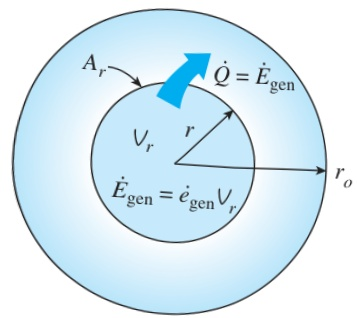
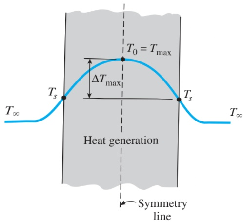

106 HEAT CONDUCTION EQUATION

FIGURE 2–56

Heat conducted through a cylindrical shell of radius r is equal to the heat generated within a shell.

FIGURE 2–57

The maximum temperature in a symmetrical solid with uniform heat generation occurs at its center.

Note that the rise in surface temperature  $ T_{s} $  is due to heat generation in the solid.

Reconsider heat transfer from a long solid cylinder with heat generation. We mentioned above that, under steady conditions, the entire heat generated within the medium is conducted through the outer surface of the cylinder. Now consider an imaginary inner cylinder of radius r within the cylinder (Fig. 2–56). Again the heat generated within this inner cylinder must be equal to the heat conducted through its outer surface. That is, from Fourier's law of heat conduction,

 $$ -k A_{r}\frac{d T}{d r}=\dot{e}_{\mathrm{g e n}}V_{r} $$ 

where  $ A_{r}=2\pi rL $  and  $ V_{r}=\pi r^{2}L $  at any location r. Substituting these expressions into Eq. 2–70 and separating the variables, we get

 $$ -k(2\pi rL)\frac{dT}{dr}=\dot{e}_{gen}(\pi r^{2}L)\quad\rightarrow\quad dT=-\frac{\dot{e}_{gen}}{2k}rdr $$ 

Integrating from r = 0 where  $  T(0) = T_{0}  $  to  $ r = r_{o} $  where  $  T(r_{o}) = T_{s}  $  yields

 $$ \Delta T_{\mathrm{max,cylinder}}=T_{0}-T_{s}=\frac{\dot{e}_{\mathrm{gen}}r_{o}^{2}}{4k} $$ 

where  $ T_{0} $  is the centerline temperature of the cylinder, which is the maximum temperature, and  $ \Delta T_{max} $  is the difference between the centerline and the surface temperatures of the cylinder, which is the maximum temperature rise in the cylinder above the surface temperature. Once  $ \Delta T_{max} $  is available, the centerline temperature can easily be determined from (Fig. 2–57)

 $$ T_{\mathrm{c e n t e r}}=T_{0}=T_{s}+\Delta T_{\mathrm{m a x}} $$ 

The approach outlined above can also be used to determine the maximum temperature rise in a plane wall of thickness 2L with both sides of the wall maintained at the same temperature  $ T_{s} $  and a solid sphere of radius  $ r_{o} $ , with these results:

 $$ \Delta T_{max,plane wall}=\frac{\dot{e}_{gen}L^{2}}{2k} $$ 

 $$ \Delta T_{max,sphere}=\frac{\dot{e}_{gen}r_{o}^{2}}{6k} $$ 

Again the maximum temperature at the center can be determined from Eq. 2–72 by adding the maximum temperature rise to the surface temperature of the solid.

## EXAMPLE 2–17 Centerline Temperature of a Resistance Heater

A 2-kW resistance heater wire whose thermal conductivity is  $ k = 15 \, W/m \cdot K $  has a diameter of  $ D = 4 \, mm $  and a length of  $ L = 0.5 \, m $ , and is used to boil water (Fig. 2–58). If the outer surface temperature of the resistance wire is  $ T_{s} = 105^{\circ}C $ , determine the temperature at the center of the wire.