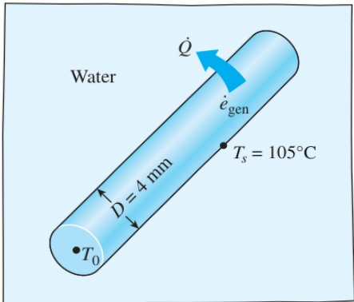
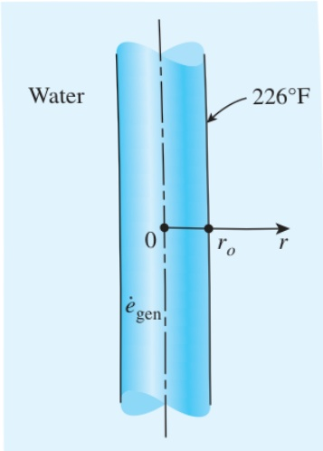

SOLUTION The center temperature of a resistance heater submerged in water is to be determined.

Assumptions 1 Heat transfer is steady since there is no change with time. 2 Heat transfer is one-dimensional since there is thermal symmetry about the centerline and no change in the axial direction. 3 Thermal conductivity is constant. 4 Heat generation in the heater is uniform.

Properties The thermal conductivity is given to be  $ k = 15 \, W/m \cdot K $ .

Analysis The 2-kW resistance heater converts electric energy into heat at a rate of 2 kW. The heat generation per unit volume of the wire is

 $$ \dot{e}_{gen}=\frac{\dot{E}_{gen}}{V_{wire}}=\frac{\dot{E}_{gen}}{\pi r_{o}^{2}L}=\frac{2000W}{\pi(0.002m)^{2}(0.5m)}=0.318\times10^{9}W/m^{3} $$ 

Then the center temperature of the wire is determined from Eq. 2–71 to be

 $$ T_{0}=T_{s}+\frac{\dot{e}_{gen}r_{o}^{2}}{4k}=105^{\circ}\mathrm{C}+\frac{(0.318\times10^{9}\mathrm{W/m^{3}})(0.002\mathrm{m})^{2}}{4\times(15\mathrm{W/m^{\cdot}C})}=126^{\circ}\mathrm{C} $$ 

Discussion Note that the temperature difference between the center and the surface of the wire is  $ 21^{\circ} $ C. Also, the thermal conductivity units W/m·°C and W/m·K are equivalent.

We have developed these relations using the intuitive energy balance approach. However, we could have obtained the same relations by setting up the appropriate differential equations and solving them, as illustrated in Examples 2–18 and 2–19.

## EXAMPLE 2–18 Variation of Temperature in a Resistance Heater

A long homogeneous resistance wire of radius  $ r_{o}=0.2 $  in and thermal conductivity  $ k=7.8\ Btu/h\cdotft\cdot^{\circ}F $  is being used to boil water at atmospheric pressure by the passage of electric current, as shown in Fig. 2–59. Heat is generated in the wire uniformly as a result of resistance heating at a rate of  $ \dot{e}_{gen}=2400\ Btu/h\cdotin^{3} $ . If the outer surface temperature of the wire is measured to be  $ T_{s}=226^{\circ}F $ , obtain a relation for the temperature distribution, and determine the temperature at the centerline of the wire when steady operating conditions are reached.

SOLUTION This heat transfer problem is similar to the problem in Example 2–17, except that we need to obtain a relation for the variation of temperature within the wire with r. Differential equations are well suited for this purpose.

Assumptions 1 Heat transfer is steady since there is no change with time. 2 Heat transfer is one-dimensional since there is no thermal symmetry about the centerline and no change in the axial direction. 3 Thermal conductivity is constant. 4 Heat generation in the wire is uniform.

Properties The thermal conductivity is given to be  $ k = 7.8  Btu/h\cdotft\cdot^{\circ}F $ .

## CHAPTER 2

Analysis The differential equation which governs the variation of temperature in the wire is simply Eq. 2–27,

 $$ \frac{1}{r}\frac{d}{d r}\left(r\frac{d T}{d r}\right)+\frac{\dot{e}_{\mathrm{g e n}}}{k}=0 $$ 

FIGURE 2–58

Schematic for Example 2–17.

FIGURE 2–59

Schematic for Example 2–18.

