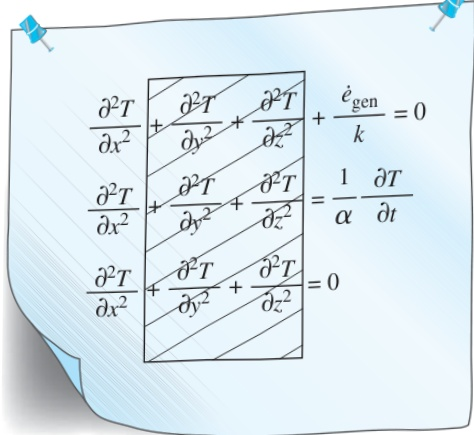
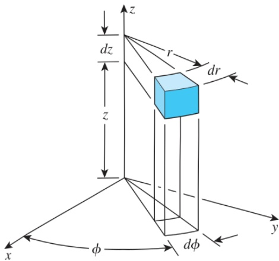
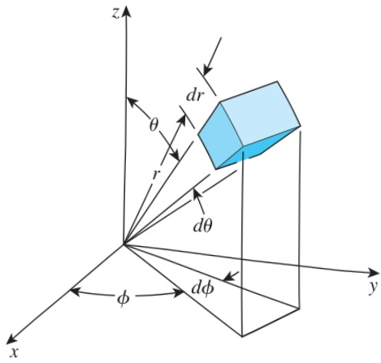

(1) Steady-state:

(called the Poisson equation)

 $$ \frac{\partial^{2}T}{\partial x^{2}}+\frac{\partial^{2}T}{\partial y^{2}}+\frac{\partial^{2}T}{\partial z^{2}}+\frac{\dot{e}_{\mathrm{gen}}}{k}=0 $$ 

(2) Transient, no heat generation: (called the diffusion equation)

 $$ \frac{\partial^{2}T}{\partial x^{2}}+\frac{\partial^{2}T}{\partial y^{2}}+\frac{\partial^{2}T}{\partial z^{2}}=\frac{1}{\alpha}\frac{\partial T}{\partial t} $$ 

(3) Steady-state, no heat generation: (called the Laplace equation)

 $$ \frac{\partial^{2}T}{\partial x^{2}}+\frac{\partial^{2}T}{\partial y^{2}}+\frac{\partial^{2}T}{\partial z^{2}}=0 $$ 

Note that in the special case of one-dimensional heat transfer in the x-direction, the derivatives with respect to y and z drop out and the equations above reduce to the ones developed in the previous section for a plane wall (Fig. 2–21).

## Cylindrical Coordinates

The general heat conduction equation in cylindrical coordinates can be obtained from an energy balance on a volume element in cylindrical coordinates, shown in Fig. 2–22, by following the steps just outlined. It can also be obtained directly from Eq. 2–38 by coordinate transformation using the following relations between the coordinates of a point in rectangular and cylindrical coordinate systems:

 $$ x=r\cos\phi,\quad y=r\sin\phi,\quad and\quad z=z $$ 

After lengthy manipulations, we obtain

 $$ \frac{1}{r}\frac{\partial}{\partial r}\left(k r\frac{\partial T}{\partial r}\right)+\frac{1}{r^{2}}\frac{\partial}{\partial\phi}\left(k\frac{\partial T}{\partial\phi}\right)+\frac{\partial}{\partial z}\left(k\frac{\partial T}{\partial z}\right)+\dot{e}_{\mathrm{g e n}}=\rho c\frac{\partial T}{\partial t} $$ 

## Spherical Coordinates

The general heat conduction equations in spherical coordinates can be obtained from an energy balance on a volume element in spherical coordinates, shown in Fig. 2–23, by following the steps outlined above. It can also be obtained directly from Eq. 2–38 by coordinate transformation using the following relations between the coordinates of a point in rectangular and spherical coordinate systems:

 $$ x=r\cos\phi\sin\theta,\quad y=r\sin\phi\sin\theta,\quad and\quad z=\cos\theta $$ 

Again after lengthy manipulations, we obtain

 $$ \frac{1}{r^{2}}\frac{\partial}{\partial r}\left(kr^{2}\frac{\partial T}{\partial r}\right)+\frac{1}{r^{2}\sin^{2}\theta}\frac{\partial}{\partial\phi}\left(k\frac{\partial T}{\partial\phi}\right)+\frac{1}{r^{2}\sin\theta}\frac{\partial}{\partial\theta}\left(k\sin\theta\frac{\partial T}{\partial\theta}\right)+\dot{e}_{gen}=\rho c\frac{\partial T}{\partial t} $$ 

Obtaining analytical solutions to these differential equations requires a knowledge of the solution techniques of partial differential equations, which is beyond the scope of this introductory text. Here we limit our consideration to one-dimensional steady-state cases, since they result in ordinary differential equations.

## CHAPTER 2

FIGURE 2–21

The three-dimensional heat conduction equations reduce to the one-dimensional ones when the temperature

varies in one dimension only.

FIGURE 2–22

A differential volume element in cylindrical coordinates.

FIGURE 2–23

A differential volume element in spherical coordinates.