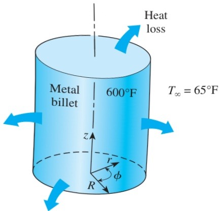

FIGURE 2–24 Schematic for Example 2–5.

## EXAMPLE 2–5 Heat Conduction in a Short Cylinder

A short cylindrical metal billet of radius R and height h is heated in an oven to a temperature of  $ 600^{\circ}F $  throughout and is then taken out of the oven and allowed to cool in ambient air at  $ T_{\infty} = 65^{\circ}F $  by convection and radiation. Assuming the billet is cooled uniformly from all outer surfaces and the variation of the thermal conductivity of the material with temperature is negligible, obtain the differential equation that describes the variation of the temperature in the billet during this cooling process.

SOLUTION A short cylindrical billet is cooled in ambient air. The differential equation for the variation of temperature is to be obtained.

Analysis The billet shown in Fig. 2–24 is initially at a uniform temperature and is cooled uniformly from the top and bottom surfaces in the z-direction as well as the lateral surface in the radial r-direction. Also, the temperature at any point in the ball changes with time during cooling. Therefore, this is a two-dimensional transient heat conduction problem since the temperature within the billet changes with the radial and axial distances r and z and with time t. That is,  $  T = T(r, z, t)  $ .

The thermal conductivity is given to be constant, and there is no heat generation in the billet. Therefore, the differential equation that governs the variation of temperature in the billet in this case is obtained from Eq. 2–43 by setting the heat generation term and the derivatives with respect to  $ \phi $  equal to zero. We obtain

 $$ \frac{1}{r}\frac{\partial}{\partial r}\bigg(k r\frac{\partial T}{\partial r}\bigg)+\frac{\partial}{\partial z}\bigg(k\frac{\partial T}{\partial z}\bigg)=\rho c\frac{\partial T}{\partial t} $$ 

In the case of constant thermal conductivity, it reduces to

 $$ \frac{1}{r}\frac{\partial}{\partial r}\left(r\frac{\partial T}{\partial r}\right)+\frac{\partial^{2}T}{\partial z^{2}}=\frac{1}{\alpha}\frac{\partial T}{\partial t} $$ 

which is the desired equation.

Discussion Note that the boundary and initial conditions have no effect on the differential equation.

## 2 –4 - BOUNDARY AND INITIAL CONDITIONS

The heat conduction equations above were developed using an energy balance on a differential element inside the medium, and they remain the same regardless of the thermal conditions on the surfaces of the medium. That is, the differential equations do not incorporate any information related to the conditions on the surfaces such as the surface temperature or a specified heat flux. Yet we know that the heat flux and the temperature distribution in a medium depend on the conditions at the surfaces, and the description of a heat transfer problem in a medium is not complete without a full description of the thermal conditions at the bounding surfaces of the medium. The mathematical expressions of the thermal conditions at the boundaries are called the boundary conditions.