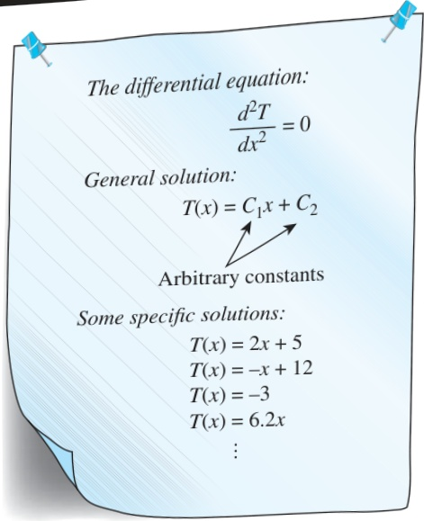
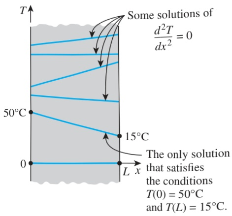

From a mathematical point of view, solving a differential equation is essentially a process of removing derivatives, or an integration process, and thus the solution of a differential equation typically involves arbitrary constants (Fig. 2–25). It follows that to obtain a unique solution to a problem, we need to specify more than just the governing differential equation. We need to specify some conditions (such as the value of the function or its derivatives at some value of the independent variable) so that forcing the solution to satisfy these conditions at specified points will result in unique values for the arbitrary constants and thus a unique solution. But since the differential equation has no place for the additional information or conditions, we need to supply them separately in the form of boundary or initial conditions.

Consider the variation of temperature along the wall of a brick house in winter. The temperature at any point in the wall depends on, among other things, the conditions at the two surfaces of the wall such as the air temperature of the house, the velocity and direction of the winds, and the solar energy incident on the outer surface. That is, the temperature distribution in a medium depends on the conditions at the boundaries of the medium as well as the heat transfer mechanism inside the medium. To describe a heat transfer problem completely, two boundary conditions must be given for each direction of the coordinate system along which heat transfer is significant (Fig. 2–26). Therefore, we need to specify two boundary conditions for one-dimensional problems, four boundary conditions for two-dimensional problems, and six boundary conditions for three-dimensional problems. In the case of the wall of a house, for example, we need to specify the conditions at two locations (the inner and the outer surfaces) of the wall since heat transfer in this case is one-dimensional. But in the case of a parallelepiped, we need to specify six boundary conditions (one at each face) when heat transfer in all three dimensions is significant.

The physical argument presented above is consistent with the mathematical nature of the problem since the heat conduction equation is second order (i.e., involves second derivatives with respect to the space variables) in all directions along which heat conduction is significant, and the general solution of a second-order linear differential equation involves two arbitrary constants for each direction. That is, the number of boundary conditions that needs to be specified in a direction is equal to the order of the differential equation in that direction.

Reconsider the brick wall already discussed. The temperature at any point on the wall at a specified time also depends on the condition of the wall at the beginning of the heat conduction process. Such a condition, which is usually specified at time t = 0, is called the initial condition, which is a mathematical expression for the temperature distribution of the medium initially. Note that we need only one initial condition for a heat conduction problem regardless of the dimension since the conduction equation is first order in time (it involves the first derivative of temperature with respect to time).

In rectangular coordinates, the initial condition can be specified in the general form as

 $$ T(x,y,z,0)=f(x,y,z) $$ 

where the function  $  f(x, y, z)  $  represents the temperature distribution throughout the medium at time t = 0. When the medium is initially at a uniform

## 83 CHAPTER 2

 $$ \frac{d^{2}T}{dx^{2}}=0 $$ 

 $$ T(x)=C_{1}x+C_{2} $$ 

FIGURE 2–25

The general solution of a typical differential equation involves arbitrary constants, and thus an infinite number of solutions.

 $$ T(L)=15^{\circ}C. $$ 

To describe a heat transfer problem completely, two boundary conditions must be given for each direction along which heat transfer is significant.