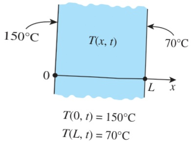
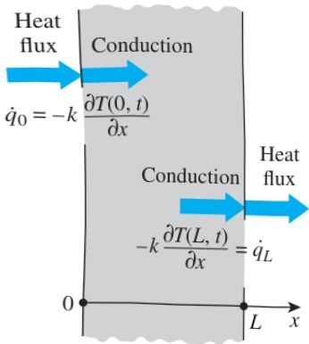

FIGURE 2–27

Specified temperature boundary conditions on both surfaces of a plane wall.

FIGURE 2–28

Specified heat flux boundary conditions on both surfaces of a plane wall.

temperature of $T_{i}$, the initial condition in Eq. 2–45 can be expressed as $T(x,y,z,0)=T_{i}$. Note that under steady conditions, the heat conduction equation does not involve any time derivatives, and thus we do not need to specify an initial condition.

The heat conduction equation is first order in time, and thus the initial condition cannot involve any derivatives (it is limited to a specified temperature). However, the heat conduction equation is second order in space coordinates, and thus a boundary condition may involve first derivatives at the boundaries as well as specified values of temperature. Boundary conditions most commonly encountered in practice are the specified temperature, specified heat flux, convection, and radiation boundary conditions.

## 1 Specified Temperature Boundary Condition

The temperature of an exposed surface can usually be measured directly and easily. Therefore, one of the easiest ways to specify the thermal conditions on a surface is to specify the temperature. For one-dimensional heat transfer through a plane wall of thickness L, for example, the specified temperature boundary conditions can be expressed as (Fig. 2–27)

 $$ \begin{aligned}T(0,t)&=T_{1}\\T(L,t)&=T_{2}\end{aligned} $$ 

where  $ T_{1} $  and  $ T_{2} $  are the specified temperatures at surfaces at x = 0 and x = L, respectively. The specified temperatures can be constant, which is the case for steady heat conduction, or may vary with time.

## 2 Specified Heat Flux Boundary Condition

When there is sufficient information about energy interactions at a surface, it may be possible to determine the rate of heat transfer and thus the heat flux  $ \dot{q} $  (heat transfer rate per unit surface area, W/m $ ^{2} $ ) on that surface, and this information can be used as one of the boundary conditions. The heat flux in the positive x-direction anywhere in the medium, including the boundaries, can be expressed by Fourier's law of heat conduction as

 $$ \dot{q}=-k\frac{\partial T}{\partial x}=\begin{pmatrix}Heat flux in the\\ positive x-direction\end{pmatrix}\quad(W/m^{2}) $$ 

Then the boundary condition at a boundary is obtained by setting the specified heat flux equal to  $ -k(\partial T/\partial x) $  at that boundary. The sign of the specified heat flux is determined by inspection: positive if the heat flux is in the positive direction of the coordinate axis, and negative if it is in the opposite direction. Note that it is extremely important to have the correct sign for the specified heat flux since the wrong sign will invert the direction of heat transfer and cause the heat gain to be interpreted as heat loss (Fig. 2–28).

For a plate of thickness L subjected to heat flux of  $ 50 \, W/m^2 $  into the medium from both sides, for example, the specified heat flux boundary conditions can be expressed as

 $$ -k\frac{\partial T(0,t)}{\partial x}=50\quad and\quad-k\frac{\partial T(L,t)}{\partial x}=-50 $$ 