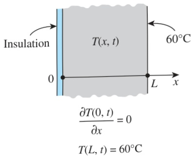
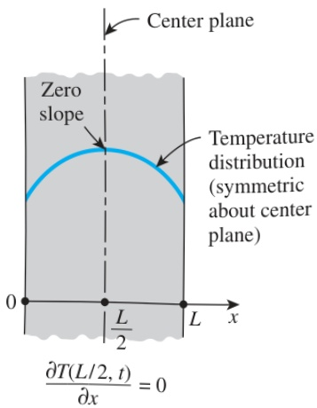

Note that the heat flux at the surface at x = L is in the negative x-direction, and thus it is  $ -50\ W/m^{2} $ . The direction of heat flux arrows at x = L in Fig. 2–28 in this case would be reversed.

## Special Case: Insulated Boundary

Some surfaces are commonly insulated in practice in order to minimize heat loss (or heat gain) through them. Insulation reduces heat transfer but does not totally eliminate it unless its thickness is infinity. However, heat transfer through a properly insulated surface can be taken to be zero since adequate insulation reduces heat transfer through a surface to negligible levels. Therefore, a well-insulated surface can be modeled as a surface with a specified heat flux of zero. Then the boundary condition on a perfectly insulated surface (at x = 0, for example) can be expressed as (Fig. 2–29)

 $$ k\frac{\partial T(0,t)}{\partial x}=0\quad or\quad\frac{\partial T(0,t)}{\partial x}=0 $$ 

That is, on an insulated surface, the first derivative of temperature with respect to the space variable (the temperature gradient) in the direction normal to the insulated surface is zero. This also means that the temperature function must be perpendicular to an insulated surface since the slope of temperature at the surface must be zero.

## Another Special Case: Thermal Symmetry

Some heat transfer problems possess thermal symmetry as a result of the symmetry in imposed thermal conditions. For example, the two surfaces of a large hot plate of thickness L suspended vertically in air is subjected to the same thermal conditions, and thus the temperature distribution in one half of the plate is the same as that in the other half. That is, the heat transfer problem in this plate possesses thermal symmetry about the center plane at x = L/2. Also, the direction of heat flow at any point in the plate is toward the surface closer to the point, and there is no heat flow across the center plane. Therefore, the center plane can be viewed as an insulated surface, and the thermal condition at this plane of symmetry can be expressed as (Fig. 2–30)

 $$ \frac{\partial T(L/2,t)}{\partial x}=0 $$ 

which resembles the insulation or zero heat flux boundary condition. This result can also be deduced from a plot of temperature distribution with a maximum, and thus zero slope, at the center plane.

In the case of cylindrical (or spherical) bodies having thermal symmetry about the center line (or midpoint), the thermal symmetry boundary condition requires that the first derivative of temperature with respect to r (the radial variable) be zero at the centerline (or the midpoint).

FIGURE 2–29

A plane wall with insulation and specified temperature boundary conditions.

FIGURE 2–30

Thermal symmetry boundary condition at the center plane of a plane wall.